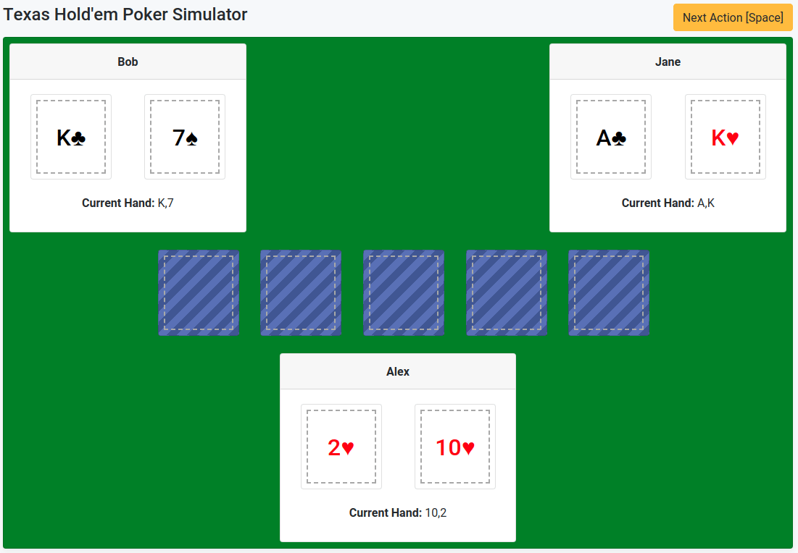

# Texas Hold'em Poker Simulator

This exercise is based on the [Texas Hold'em](https://en.wikipedia.org/wiki/Texas_hold_%27em) variant of the Poker card game.

Please read up on the rules of this game beforehand to become familiar with them, or watch this 
[video](https://www.youtube.com/watch?v=GAoR9ji8D6A).

You should understand the following concepts before continuing:

- Identifying the highest hands of the players.
  - e.g If a player has One Pair and a Three of a Kind, the game should be able to identify that the player has a 
  Full House. 

To provide a quick summary:

- At the start of the game, each player will be dealt two cards.
- Pressing space or clicking `Next Action` will put community cards on the table.
  - The first action will put three community cards on the table.
  - The second and third actions will put one community card each on the table.
- Once all five community cards slots are filled, the game will end.
- Pressing space or clicking `New Game` will start a new game.

## About the project:

The project simulates a game of poker by dealing cards out to each player, and then dealing the five community cards. 

It's made with Spring Boot, Thymeleaf provides the web interface.

Project works out of the box, and does not require any downloads except for Java 8 sdk.

Before you start applying changes to the code, it is recommended that you run the application first. To see if it's working properly.

### How to get running:
- Need at least Java 8 or higher installed
- IntelliJ IDEA is recommended. The Community Edition will do just fine.
  Otherwise, you can open the project in your editor of choice.
- To run the application, go to the project directory and `./gradlew bootRun`. 
- Check `http://localhost:8080` to see if it's working.
- To run the tests, run `./gradlew test` in the root directory of the project.

**Note on Spring and Dependency Injection:** Spring allows us to use Dependency Injection to inject the Game instance 
into our Web Controller. While knowledge of Dependency Injection and Spring is not required to answer the exam, 
familiarity of the two will help in understanding how the application works.

**Basic example of how Spring Boot with Thymeleaf:** https://spring.io/guides/gs/serving-web-content/

**Note on Thymeleaf:** While the Web UI code is complete and does not need to be modified for the exam, knowledge on how 
Thymeleaf works will help in understanding how the HTML is connected to the Java code.

## About the exam:

You've been given the start of a Texas Hold'em Poker simulator project, but the functionality is incomplete.

The Web UI code has been written and is complete. There's no need to modify the HTML code.
If you run the PokerApplication class it will start up a web server that you can access at http://localhost:8080/

This exam only covers identifying the players' hands; i.e. if a player has a Flush, Straight, Full House, plus kicker. 
Identifying the winner is out of scope.
Please note, as well, that this application is a *simulation* and not an actual *game*, with the intention of simulating how a game of poker works to someone who might not be familiar with it, as opposed to allowing people to actually play against each other.

## Exam criteria
In assessing your answers to the exam, we do not only consider the correctness of your answer but will also give value to the way you code it. For your reference, we will be assessing the exam on the following criteria:
- Correctness and completeness: Completed all the tasks and implementation has no major bugs or issues
- Object-oriented approach: Created and modified classes in accordance with best practices in object-oriented design (e.g. SOLID principles)
- Readability/coding standards: Coding conventions and style are consistent (preferrably in Java's recommended coding conventions, though this is not mandatory) and code is well-organized
- Simplicity and efficiency: Used algorithms that are easy to understand and efficient. (Note: We are not strict with using the best available SDKs in Java, especially if your expertise is not in the language)

### General Instructions
- Only the Java code will be modified. There's no need to modify the HTML.
- Public methods are defined but do not have implementations. It's up to you to provide the implementation and figure out 
where they fit in the code. Feel free to add methods or create classes if you find them necessary.
- Provide unit tests for your implementations. This covers the classes provided but without implementations and 
new classes you might create.
- Refer to the attached GIF for reference on how the application works.

### Tasks
- The task is to identify the players' highest hands and display in the web UI, as seen in the attached GIF.
  - Every time community cards are placed on the board, the players' hands are identified.
  - Test scenarios for identifying players' hands are provided to guide you in coming up with solutions. However, these 
  tests are failing. Part of the exam the exam is to make these tests pass.
  - In the application, the text displayed beside `Current Hand:` is the return of the `toString()` method of the hand 
  types. Unit tests for these `toString()` methods are failing. Part of the exam is to make these tests pass. 
- (Optional essay) What is the major flaw in this web application if we were to host it on a server for other people to use? (Please consider the technical aspect rather than the game rules when answering this question.)
